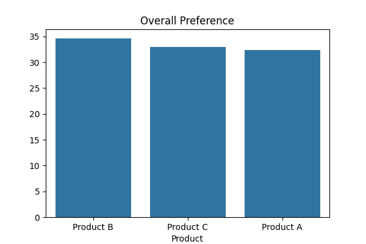
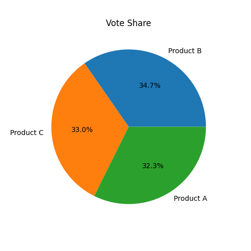
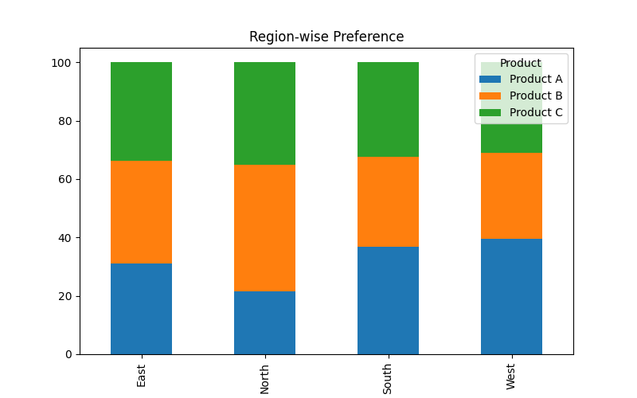
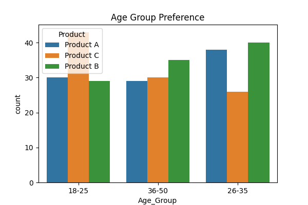
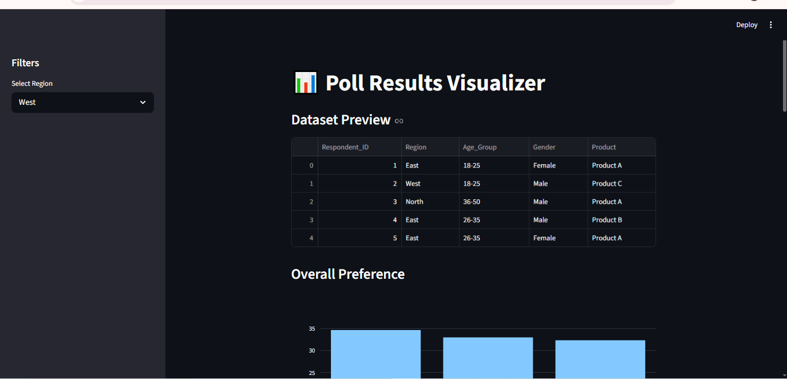
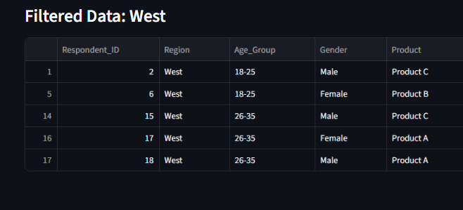
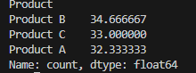

# 📊 Poll Results Visualizer

## 🚀 Overview

Poll Results Visualizer is an end-to-end data analytics project that transforms raw poll/survey data into meaningful insights using Python.

It demonstrates the complete workflow from data generation and preprocessing to analysis, visualization, and dashboarding.

---

## 🎯 Problem Statement

Raw survey data is often difficult to interpret and does not directly provide actionable insights.

Organizations need:

* Clear summaries
* Visual representations
* Comparative analysis
* Decision-making support

---

## 💡 Solution

This project:

* Generates or loads poll data (CSV / synthetic)
* Cleans and preprocesses the dataset
* Performs vote share and comparative analysis
* Visualizes insights using charts
* Provides an interactive Streamlit dashboard

---

## 📌 Features

* Synthetic poll data generation
* Data cleaning and preprocessing
* Vote share (%) calculation
* Region-wise analysis
* Age group (demographic) insights
* Bar, Pie, and Stacked charts
* Interactive Streamlit dashboard

---

## 🛠 Tech Stack

* Python
* Pandas
* NumPy
* Matplotlib
* Seaborn
* Plotly
* Streamlit

---

## 📂 Project Structure

```
Poll-Results-Visualizer/
│
├── data/
├── notebooks/
├── src/
├── images/
├── outputs/
├── app.py
├── main.py
├── requirements.txt
└── README.md
```

---

## ▶️ How to Run

### 1. Install Dependencies

```
pip install -r requirements.txt
```

### 2. Run Main Script

```
python main.py
```

### 3. Run Dashboard

```
streamlit run app.py
```

---

## 📊 Outputs

### 📈 Bar Chart



### 🥧 Pie Chart



### 📊 Region-wise Analysis



### 🧑‍🤝‍🧑 Age Group Analysis



### 💻 Dashboard



---

## 📸 Additional Screenshots

### Cleaned Data



### Vote Share Table



---

## 📊 Insights

* Identifies the most preferred product among respondents
* Highlights regional variations in preferences
* Reveals demographic trends across age groups
* Enables quick and intuitive decision-making

---

## 🧠 Use Cases

* Election polling analysis
* Customer feedback surveys
* Employee satisfaction analysis
* Product preference studies
* Academic and research analysis

---

## 🚀 Future Improvements

* Real-time poll integration
* API-based data ingestion
* Sentiment analysis for open-ended responses
* Power BI dashboard integration
* Advanced demographic segmentation

---

## 👨‍💻 Author

Manan Bhanushali

---

## ⭐ If you found this useful, consider giving it a star!
